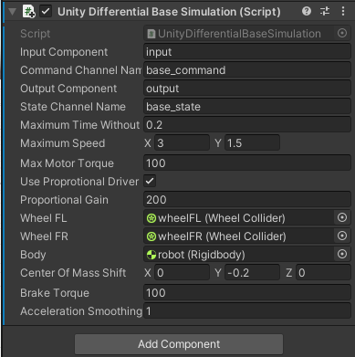
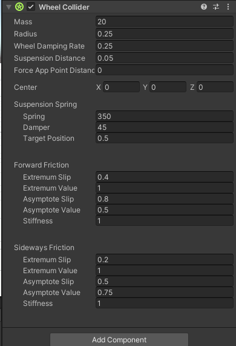
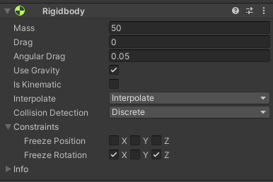

##Project for multi-purpose robot control

At the moment the robot follows the "Cube" object which could be replaced with a mouse cursor.
It is **extremely** important that the values for the properties of "UnityDifferentialBaseSimulation.cs" script stay exactly **like this**:

